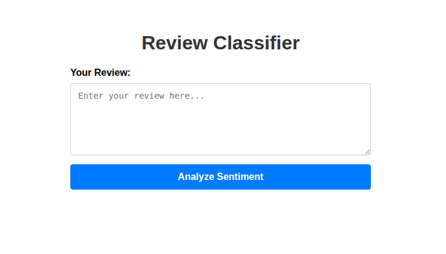

# Yelp Review Sentiment Analysis App

### 📊 Project Overview
This project was created to demonstrate proficiency in **Natural Language Processing (NLP) and Web Deployment** as part of my Data Science & Machine Learning bootcamp. The primary focus was on building an end-to-end machine learning pipeline, from text preprocessing and model training to deploying a predictive web application.

The model analyzes restaurant reviews (based on the Yelp dataset) and classifies them as **POSITIVE** or **NEGATIVE** using a Logistic Regression algorithm trained on TF-IDF word vectors.

### 🛠️ Tech Stack
* **Framework:** Flask (Web Application)
* **Machine Learning & NLP:** Scikit-learn (Logistic Regression, TF-IDF Pipeline), NLTK (WordNet, Stopwords)
* **Data Processing:** Pandas, NumPy
* **Visualization (EDA):** Matplotlib, Seaborn
* **Model Serialization:** Joblib

### 🖼️ Web App Preview
*Quick look at the web interface where users can submit reviews for instant sentiment classification.*

### 🚀 How to Run Locally
1. Clone the repo: `git clone https://github.com/jposluszny/yelp-sentiment-flask.git`
2. Install dependencies: `pip install -r requirements.txt`
3. Run the Flask app: `python app.py` (NLTK datasets will download automatically on first run)
4. Open your browser and navigate to: `http://127.0.0.1:5000/`

### 🔗 Resources
* [**🌐 Live Application**](https://nlp-project-n8ry.onrender.com) – Access the working web app.

---
*Created by **jposluszny** as part of a Data Science & ML training path.*